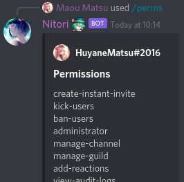
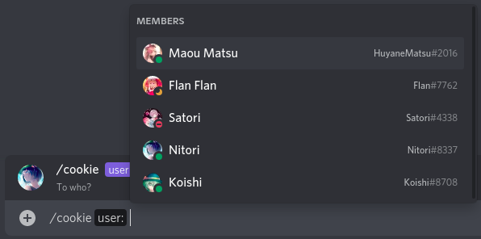
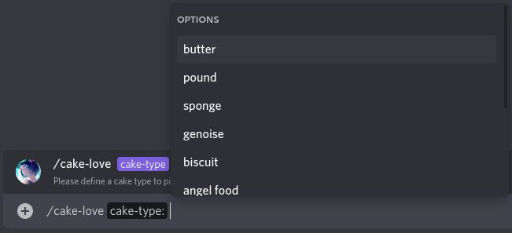
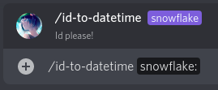
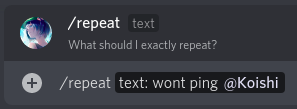
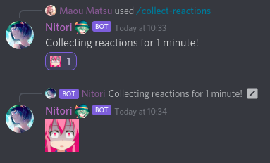
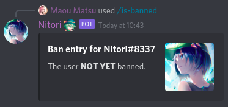
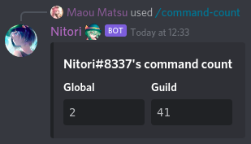

# Introduction

Slash refers to slash commands as probably known by the users or by interactions as mentioned by the api.

You can also find Discord's insufficient API documentation
[here](https://discord.com/developers/docs/interactions/application-commands#application-commands) or on their
[github repo](https://github.com/discord/discord-api-docs/tree/master/docs/interactions).

Hata supports interactions with many methods and classes, but this topic is not about their raw usage, but about the
inherent slash extension.

Not like regular commands, slash commands' format is limited by the Discord API itself, what we cannot overpass.

### Limitations

Discord sets the following limitations:

- Parameter count to `[0:25]`.
- Command name length to `[1:32]`.
- Command description length to `[2:100]`.
- Choice amount to `[1:25]`.
- Choice name length to `[1:100]`.
- Parameter name length to `[1:32]`.
- Parameter description length to `[1:32]`.
- A command can have `25` sub-commands or sub-categories.
- A sub-category can have `25` sub-commands.
- A sub-category cannot have sub-category under itself.
- Updating global commands might take up to `1` hour.
- Acknowledging must be done within `3` seconds.
- Followup messages can be sent within 15 minutes after acknowledging.
- Custom emojis only show up correctly in interaction responses when `@everyone` role has `use_external_emojis`
    permission.

The parameter types can be the following:

| Name              | Discord field | String representation | Type representation   | Output type               |
|-------------------|---------------|-----------------------|-----------------------|---------------------------|
| attachment        | attachment    | `'attachment'`        | `Attachment`          | `Attachment`              |
| boolean           | boolean       | `'bool'`              | `bool`                | `bool`                    |
| channel           | channel       | `'channel'`           | `Channel`             | `Channel`                 |
| channel_id        | channel       | `'channel_id'`        | N/A                   | `int`                     |
| expression        | string        | `'expression'`        | N/A                   | `int` / `float`           |
| float             | float         | `'float'`             | `float`               | `float`                   |
| integer           | string        | `'int'`               | `int`                 | `int`                     |
| role              | role          | `'role'`              | `Role`                | `Role`                    |
| role_id           | role          | `'role_id'`           | N/A                   | `int`                     |
| string            | string        | `'str'`               | `str`                 | `str`                     |
| mentionable       | mentionable   | `'mentionable'`       | N/A                   | `ClientUserBase`, `Role`  |
| mentionable_id    | mentionable   | `'mentionable_id'`    | N/A                   | `int`                     |
| number            | integer       | `'number'`            | N/A                   | `int`                     |
| user              | user          | `'user'`              | `User`, `UserBase`    | `ClientUserBase`          |
| user_id           | user          | `'user_id'`           | N/A                   | `int`                     |


## Parameter notes

> There are choice parameters as well, but lets talk about those only later.

### mentionable

`mentionable` field stands for `user` + `role`.

### int, number

In hata there are 2 integer input options available, one is `int` and the other one is `number`. Both has it's pros and
cons. `int` field is converted to `string` by the extension, then when receiving an interaction is converted back to
`int`. It means, when the user not gives a valid integer, the payload validation will fail and the interaction will 
fail. On other hand `number` field is inaccurate. Discord uses javascript `number` type (that's from the name comes
from as well), what equals to float64. It means integers over 53 bit will lose from their precision.

### expression

Hata implements a mathematical expression field as well. For example, you can enter `3 * 2` or `10 / 5 + 4` instead of
`6`. Even constants like `pi` or functions like `sqrt(2)` may be used. The field idea is based on
[Blender](https://www.blender.org/)'s numeric field.

The evaluation of these fields are completely safe, do not uses `eval` or other cheaped out solutions, which have
critical security vulnerabilities.

## Internal parameters

`client` (`c`) and `event` (`e`, `interaction_event`) parameters are picked up as internal parameters.

> They can be also linted as `Client` / `InteractionEvent`.

Internal parameters are not propagated towards discord, instead they are auto-fulfilled internally. They can be used
to access information about the command's context if required.

## Required oauth2 scopes

When using slash commands, adding your bot to a guild with just the regular `bot` scope is not enough. Make sure you
authorize it with `applications.commands` oauth2 scope as well. Just fill out your bot's application's id in the
`<APPLICATION_ID>` part and add the bot to your guild;
`https://discord.com/api/oauth2/authorize?client_id=<APPLICATION_ID>&scope=bot+applications.commands`.

If this error pops ups as you launched your bot: `DiscordException Forbidden (403), code=50001: Missing access`
Do not worry, you probably just need to authorize your bot with the `applications.commands` oauth2 scope.

## Setup

To setup the extension you just pass `'slash'` into the client's `extensions` parameter, or use the `setup_ext_slash`
function.

```py3
from hata import Client

Nitori = Client(TOKEN, extensions = 'slash')
```
or
```py3
from hata import Client
from hata.ext.slash import setup_ext_slash

Nitori = Client(TOKEN)
setup_ext_slash(Nitori)
```

## Optional Slasher parameters

When setupping slash extension, a few optional parameters are also supported.

### delete_commands_on_unload

Tells to the slasher whether it should delete the commands from Discord when they are removed. Defaults to `False` in
favor of working with extensions.

When unloading an extension, all of it's commands are deleted from Discord as well if set as `True`. This might be
painful when reloading global commands, because it would need 1 hour for the changes to take place.

### use_default_exception_handler

Whether the slasher default exception handler should be used to handle exceptions dropped while handling or running a
slash or a component command. Defaults to `True`.

The default slasher exception handler forwards `SlasherCommandError`-s' prettified error messages. These exceptions
are raised meanwhile looking up, or validating slash command parameters. If any other exception occurs, it will forward
a random not related error message, and call `client.events.error`.

### random_error_message_getter

Used by the default exception handler to get a random error message to forward if something goes wrong.

The default one returns some touhou relating error messages, and if you do not get the jokes, make sure to define your
own.

Here is an example how to define one.

```py3
from random import choice

ERROR_MESSAGES = (
    'Something went wrong, please try again later.',
    'Error occurred.',
    # ...
)

def random_error_message_getter():
    return choice(ERROR_MESSAGES)


# Then pass it to the client constructor ...
```

# Adding commands & responding

After the extension is setupped, commands can be added using the `client.interaction` decorator.

> Global commands are only updated after 1 hour, meanwhile guild commands immediately, so when using test commands
> make sure to use only guild bound commands. The examples will show only guild commands, tho of course global
> commands will be mentioned as well.

```py3
from hata import Embed

@Nitori.interactions(guild = TEST_GUILD)
async def perms(event):
    """Shows your permissions."""
    user_permissions = event.user_permissions
    if user_permissions:
        description = '\n'.join(permission_name.replace('_', '-') for permission_name in user_permissions)
    else:
        description = '*none*'
    
    user = event.user
    return Embed('Permissions', description).add_author(user.full_name, user.avatar_url)
```




Every `return`-ed or `yield`-ed string or embed (list or tuple of embeds as well) from a slash command will be
propagated to be sent as a response to the user, but you can also send responses manually with the
`Client.interaction_response_message_create` or with the `Client.interaction_followup_message_create` methods. There
are also other interaction related client methods, which are mentioned [later](#manual-responding).

> New commands might not show up till you restart your client (not the bot). This is **always** the case for the first
> command.

# Command Parameters

An interaction event has the following top level attributes, which you may use up to produce a proper response:

| Name              | Type              | Notes                                                                                                         |
|-------------------|---------------------------------------------------------------|---------------------------------------------------------------------------------------------------------------|
| channel           | `Channel`         | The channel from where the interaction was called. Might be a partial or `None`.                              |
| channel_id        | `int`             | The interaction event's channel's identifier.                                                                 |
| guild             | `None`, `Guild`   | The channel's guild. Might be partial or `None`                                                               |
| guild_id          | `int`             | The interaction event's guild's identifier. Set as `0` if the interaction is received from a private channel. |
| user              | `Client`, `User`  | The user who called the interaction.                                                                          |
| user_permissions  | `Permission`      | The user's permissions in the respective channel.                                                             |

> The rest of the attributes should be ignored if you are **not** writing your own interaction handler.

> If a command is called from a private channel, it's `.guild` is always `None`.


The possible parameter types are listed above in the [Limitations](#Limitations) section, tho it is a little bit more
complicated as might look for first time. All parameter has 3 fields what we need to fulfill; `name`, `type` and
`description`. Their definition is expected in the following format: `name: (type, description)`.

```py3
from hata import Embed

@Nitori.interactions(guild = TEST_GUILD)
async def cookie(
    event,
    user: ('user', 'To who?'),
):
    """Gifts a cookie!"""
    return Embed(description = f'{event.user:f} just gifted a cookie to {user:f} !')
```



## SlashParameter

Parameter definition can be defined with `SlashParameter`-s as well. An advantage of slash parameters, that they
support keyword-only parameters, like `channel_types`, `min_value`, `max_value`.

```py3
from random import choice
from hata import Embed
from hata.ext.slash import P # P is a shortcut for `SlashParameter`

CAKES = [
    'https://tenor.com/view/chocolate-cake-candles-gif-15613028',
    'https://tenor.com/view/cake-yummy-hungry-eating-birthday-cake-gif-18507935',
    'https://tenor.com/view/cake-fat-slice-gif-4931308',
]

@Nitori.interactions(guild = TEST_GUILD)
async def cake(
    event,
    user: P('user', 'To who?'),
):
    """Gifts a cake!"""
    return Embed(description = f'{event.user:f} just gifted a cookie to {user:f} !').add_image(choice(CAKES))
```

# Optional parameters

Whether a command parameter is required or not, is defined whether you assign default value to it.

Examples are the  `cookie` command above for required and the `guild-icon` command for not required one.

> Do not forget that in python default-value parameters always follows non-default-value parameters.

Lets improve the `cookie` command to not require user!

```py3
from hata import Embed

@Nitori.interactions(guild = TEST_GUILD)
async def cookie(
    client,
    event,
    user: ('user', 'To who?') = None,
):
    """Gifts a cookie!"""
    if user is None:
        source_user = client
        target_user = event.user
    else:
        source_user = event.user
        target_user = user
    
    return Embed(description = f'{source_user:f} just gifted a cookie to {target_user:f} !')
```




# Choice parameters

Slash commands support choice parameters, for string, integer and float types. Each choice has a `name` and a
`value` field. All values must be the same type, either `str`, `int` or `float` as mentioned above.

Choice parameters go to the "annotation type field" and they can be either:
- Dictionary of `name - value` items.
- List of tuple `name - value` pairs.
- Set of tuple `name - value` pairs.
- List of `value`-s.
- Set of `value`-s.
- Iterables of `name - value` pairs.
- Iterables of `value`-s.
- Enum

> Dictionary and set choices are sorted alphabetically, so if order matters for you, use list.
>
> Formatting choices into a table-like appearance might help, but it is up to you.

```py3
from hata import Embed

@Nitori.interactions(guild = TEST_GUILD)
async def guild_icon(
    event,
    choice: (
        {
            'Icon': 'icon',
            'Banner': 'banner',
            'Discovery-splash': 'discovery_splash',
            'Invite-splash': 'invite_splash',
        },
        'Which icon of the guild?',
    ) = 'icon',
):
    """Shows the guild's icon or it's selected splash."""
    guild = event.guild
    if (guild is None) or guild.partial:
        return Embed('Error', 'The command unavailable in guilds, where the application\'s bot is not in.')
    
    if choice == 'icon':
        name = 'icon'
        url = guild.icon_url_as(size = 4096)
        hash_value = guild.icon_hash
    
    elif choice == 'banner':
        name = 'banner'
        url = guild.banner_url_as(size = 4096)
        hash_value = guild.banner_hash
    
    elif choice == 'discovery_splash':
        name = 'discovery splash'
        url = guild.discovery_splash_url_as(size = 4096)
        hash_value = guild.discovery_splash_hash
    
    else:
        name = 'invite splash'
        url = guild.invite_splash_url_as(size = 4096)
        hash_value = guild.invite_splash_hash
    
    if url is None:
        color = (event.id >> 22) & 0xFFFFFF
        return Embed(f'{guild.name} has no {name}', color = color)
    
    color = hash_value & 0xFFFFFF
    return Embed(f'{guild.name}\'s {name}', color = color, url = url).add_image(url)
```


If you find defining choice parameters inside of the "function parameter definition" too confusing, consider creating
a variable and annotate that instead.

```py3
GUILD_ICON_CHOICES = {
    'Icon': 'icon',
    'Banner': 'banner',
    'Discovery-splash': 'discovery_splash',
    'Invite-splash': 'invite_splash',
}

@Nitori.interactions(guild = TEST_GUILD)
async def guild_icon(
    event,
    choice: (GUILD_ICON_CHOICES, 'Which icon of the guild?' ) = 'icon',
):
    """Shows the guild's icon."""
    # Code goes brr..
```

Same as list (using table-like formatting):

```py3
GUILD_ICON_CHOICES = [
    ('Icon'             , 'icon'             ),
    ('Banner'           , 'banner'           ),
    ('Discovery-splash' , 'discovery_splash' ),
    ('Invite-splash'    , 'invite_splash'    ),
]
```


When defining annotations only as `value`-s, the `name`-s will set as `str(value)`.

```py3
from random import random

@Nitori.interactions(guild = TEST_GUILD)
async def roll(
    dice_count: (range(1, 7), 'With how much dice do you wanna roll?') = 1,
):
    """Rolls with dices."""
    amount = 0
    for _ in range(dice_count):
        amount += round(1.0 + (random() * 5.0))
    
    return str(amount)
```


### Enums

Enums may also be used as choices. Other limitations still apply.

```py3
from enum import Enum

from hata import Embed


class PetInfoFieldType(Enum):
    all = 'all'
    starve = 'hunger'
    love = 'love'
    energy = 'energy'


def create_pet_info_field(field, user):
     return f'**{field.value}**: {(user.id >> (22 + len(field.value))) % 101}'


@Nitori.interactions(guild = TEST_GUILD)
async def pet_info(client, event, field: PetInfoFieldType = PetInfoFieldType.all):
    user = event.user
    
    if field == PetInfoFieldType.all:
        description = '\n'.join(
            create_pet_info_field(field, user) for field in PetInfoFieldType
            if field != PetInfoFieldType.all
        )
    
    else:
        description = create_pet_info_field(field, user)
    
    
    return Embed(
        f'{event.user}\'s pet info',
        description,
    )
```


# Decorator parameters

`client.interactions` has no requires parameters, so can be used just as `@client.interactions` decorator, however in
most of the cases of slash commands, you want to also pass additional parameters.

### guild

The `guild` parameter is already mentioned above, it defines in which guild(s) the command is available. Can be given
either as `Guild` or `guild_id` or as a `list` of `set` of them as well.

### is_global

Defines whether the command is a global command. Accepts either `True` of `False`.

Mutually exclusive with the `guild` parameter. If neither `guild` not `is_global` parameter is given, the command will
become "non-global". More about them in the [Non-global](#non-global-commands) section.

### show_for_invoking_user_only

Whether the source message should be shown only for the invoker user. Defaults to `False`.

This is a perfect time to change up our `/perms` command.

```py3
from hata import Embed

@Nitori.interactions(guild = TEST_GUILD, show_for_invoking_user_only = True)
async def perms(event):
    """Shows your permissions."""
    user_permissions = event.user_permissions
    if user_permissions:
        description = '\n'.join(permission_name.replace('_', '-') for permission_name in user_permissions)
    else:
        description = '*none*'
    
    user = event.user
    return Embed('Permissions', description).add_author(user.full_name, user.avatar_url)
```


### name

The most important feature, changing the name! By default a command's name will be it's function's name.

An important note might be, that the command's name might be displayed differently by Discord, so the extension will
do the prettification for you internally.

As an example: an already used function's name has conflict with the command's.

```py3
from hata import id_to_datetime, DATETIME_FORMAT_CODE, elapsed_time

@Nitro.interactions(guild = TEST_GUILD, name = 'id-to-time')
async def idtotime(
    snowflake: ('int', 'Id please!'),
):
    """Converts the given Discord snowflake to time."""
    time = id_to_datetime(snowflake)
    return f'{time:{DATETIME_FORMAT_CODE}}\n{elapsed_time(time)} ago'
```



You can resolve name conflicts in an other way as well. Trailing `_` characters are ignored.

```py3
from hata import id_to_datetime, DATETIME_FORMAT_CODE, elapsed_time

@Nitori.interactions(guild = TEST_GUILD)
async def id_to_datetime_(
    snowflake: ('int', 'Id please!'),
):
    """Converts the given Discord snowflake to time."""
    time = id_to_datetime(snowflake)
    return f'{time:{DATETIME_FORMAT_CODE}}\n{elapsed_time(time)} ago'
```

### description

Description can be passed instead of defining as docstring. As an example this feature can be used when auto-generating
commands, like:

```py3
class Action:
    __slots__ = ('action_name', 'embed_color', )
    
    def __init__(self, action_name, embed_color):
        self.action_name = action_name
        self.embed_color = embed_color
    
    async def __call__(
        self,
        client,
        event,
        user: ('user', 'Who?') = None,
    ):
        if user is None:
            source_user = client
            target_user = event.user
        else:
            source_user = event.user
            target_user = user
        
        return Embed(description = f'{source_user:f} {self.action_name}s {target_user:f} !', color = self.embed_color)

for action_name, embed_color in (('pat', 0x325b34), ('hug', 0xa4b51b), ('lick', 0x7840c3), ('slap', 0xdff1dc),):
    Nitori.interactions(Action(action_name, embed_color),
        name = action_name,
        description = f'Do you want some {action_name}s, or to {action_name} someone?',
        guild = TEST_GUILD,
    )

# Cleanup
del action_name, embed_color
```


### delete_on_unload

Command specific setting, to overwrite the parent slasher's [delete_commands_on_unload](#delete_commands_on_unload).

### allow_in_dm

Whether the command can be used in private channels. This parameter is only meaningful for global commands. Can be
used to *disable* commands in dm.

```py3
from hata import Embed

@Nitori.interactions(is_global = True, allow_in_dm = False)
async def guild_features(event):
    """Shows the guild's features."""
    guild = event.guild
    
    return Embed(
        f'{guild.name}\'s features',    
        ', '.join(sorted(feature.name for feature in guild.features)),
    ).add_thumbnail(
        guild.icon_url
    )
```

### required_permissions

Allows you to customize the required permissions to see & use the command.

```py3
from hata import DiscordException, Permission

@Nitori.interactions(guild = TEST_GUILD, required_permissions = Permission().update_by_keys(manage_channel = True))
async def channel_create(
    client, event, name: (str, 'The channel\'s name to create.')
):
    """Creates a channel"""
    
    name_length = len(name)
    if (name_length < 2) or (name_length > 32):
        return 'Please keep name length between 2 and 32 characters.'
    
    try:
        await client.channel_create(event.guild, name, parent=event.channel.parent)
    except DiscordException as err:
        # Error message can be over 2k length
        reason = str(err)
        if len(reason) > 1900:
            reason = reason[:1900] + '...'
        
        return f'Creating channel failed:\n{reason}'
    
    return 'Successfully created the channel.'
```

# Tricks and Tips

### Sending rich response

With `return` and `yield` statements, you can only send either `content` or `embed` fields. Using these statements is
still way more comfy than typing out the whole client method, so there is a middle way, called `InteractionResponse`.

```py3
from hata.ext.slash import InteractionResponse

@Nitori.interactions(guild = TEST_GUILD)
async def repeat(
    text: ('str', 'The content to repeat')
):
    """What should I exactly repeat?"""
    if not text:
        text = 'nothing to repeat'
    
    return InteractionResponse(text, allowed_mentions = None)
```





When checking the message's payload, it is indeed visible, that Koishi was not pinged.

```py3
...
"mention_everyone": false,
"mention_roles": [],
"mentions": [],
...
```

### Responding multiple times

Sometimes you might wanna respond multiple times on an event. At this case use `yield` instead of `return`.

```py3
from random import random, choice
from scarletio import sleep

IMPROVISATION_CHOICES = [
    'Did Marisa really adopt Reimu?',
    'Yuuka beat Goku.',
    'Marisa! You know what you did!',
    'Thick cucumber Nitori',
    'Nitori Kappashiro',
    'Suwako\'s secret family technique is so lovely.',
    'Reimu\'s armpits, yeeaaa...',
    'Have you heard of Izaoyi love-shop?',
    'Marisa\'s underskirt shrooms are poggers'
]

@Nitori.interactions(guild = TEST_GUILD)
async def improvise():
    """Improvises some derpage"""
    yield '*Thinks*'
    await sleep(1.0 + random() * 4.0)
    yield choice(IMPROVISATION_CHOICES)
```


> Python limitation, you cannot `return` any value if you use `yield` inside of an `async def`.

### Acknowledge the interaction event

The first response can be also empty just to acknowledge the event.

```py3
from time import perf_counter

@Nitori.interactions(guild = TEST_GUILD, wait_for_acknowledgement = True)
async def ping():
    """HTTP ping-pong."""
    start = perf_counter()
    yield
    delay = (perf_counter() - start) * 1000.0
    
    yield f'{delay:.0f} ms'
```


Acknowledging can be useful if you do an additional request to an other site, because the event need to be acknowledged
within 3 seconds to send followup messages. If the event is acknowledged, followup messages can be sent within an
additional 15 minutes!

By default acknowledgement will run parallel with the command. To wait till the acknowledgement is done, use the
`wait_for_acknowledgement` decorator parameter.

### Handling attachments

There is a lot of confusing around attachments, but in reality they are pretty simple. Attachment parameters
produce the same attachment objects as messages do and they can be handled on the same way. Checking their name, size,
content type and resolution, all the same.

Here is a simple message of downloading the passed attachment and sending it back.

```py3
from hata.ext.slash import InteractionResponse

@Nitori.interactions(guild = TEST_GUILD)
async def resend(
    client,
    attachment: ('attachment', 'File!'),
):
    yield
    file = await client.download_attachment(attachment)
    yield InteractionResponse(file = (attachment.name, file))
```

### Capturing messages & exceptions

Acknowledging will never return a message object (Discord side), so it cannot be captured either, but followup messages
will do. So can do the following with them:

```py3
message = yield content
```

Exceptions can be captured on the same way as well.

```py3
try:
    yield content
except BaseException as err:
    # Do things.
```

After an interaction event is acknowledged with empty content, the second `yield` will edit the source message,
causing no `Message` instance to be retrieved. `InteractionResponse` will always acknowledge the respective event first,
meaning it will always yield back a `Message` instance.

```py3
from scarletio import sleep
from hata.ext.slash import InteractionResponse

@Nitori.interactions(guild = TEST_GUILD)
async def collect_reactions():
    """Collects reactions"""
    message = yield InteractionResponse('Collecting reactions for 1 minute!')
    await sleep(60.0)
    
    reactions = message.reactions
    if (reactions is not None) and reactions:
        emojis = list(reactions)
        # Limit reactions to 16 to avoid error from Discord
        del emojis[16:]
        
        yield ' '.join(emoji.as_emoji for emoji in emojis)
    else:
        yield 'No reactions were collected.'
```



### Giving away control flow

Sometimes you have more commands calling the same coroutine function, which executes shared code among more commands.
This is all good, till the function is not a coroutine generator function. As we know you can yield from a generator
inside of one, but this is not exactly true at the case of coroutine generators.

```py3
NEKO_LIFE = 'https://nekos.life/api/v2'

async def get_neko_life(client, keyword):
    yield
    url = f'{NEKO_LIFE}/{keyword}'
    
    async with client.http.get(url) as response:
        if response.status == 200:
            data = await response.json()
            content = data[keyword]
        else:
            content = 'Couldn\'t contact the API right now... OwO'
    
    yield content


@Nitori.interactions(guild = TEST_GUILD)
async def text_cat(client):
    """I will send text cats :3"""
    async for content in get_neko_life(client, 'cat')
        yield content

@Nitori.interactions(guild = TEST_GUILD)
async def why(client):
    """why are you using this commands?"""
    async for content in get_neko_life(client, 'why')
        yield content
```

Python misses asynchronous version of `yield from`, so you need to write out a full `async for` loop, making your code
loop derpy, or `yield` or `return` it, because having regard to this case, it is allowed to `yield` and `return`
`coroutine generator` object as well.

```py3
@Nitori.interactions(guild = TEST_GUILD)
async def text_cat(client):
    """I will send text cats :3"""
    return get_neko_life(client, 'cat')

@Nitori.interactions(guild = TEST_GUILD)
async def why(client):
    """why are you using this commands?"""
    yield get_neko_life(client, 'why')
```

Both works completely fine.


### Aborting command

Commands may be aborted using the `abort` function. It leaves from the command's execution and sends the passed
content familiarly to `InteractionResponse`. The one difference is, that abort should be mainly used to send end-command
error message, so if only string `content` is passed to abort, it will show up only for the invoking user.

```py3
from hata import DiscordException, ERROR_CODES, Embed
from hata.ext.slash import abort

@Nitori.interactions(guild = TEST_GUILD)
async def is_banned(client, event,
    user: ('user', 'Who should I check?')
):
    """Checks whether the user is banned."""
    if not event.user_permissions.can_ban_users:
        abort('You need to have `ban users` permissions to do this.')
    
    if not event.channel.cached_permissions_for(client).can_ban_users:
        abort('I need to have `ban users` permissions to do this.')
    
    yield # Acknowledge the event.
    
    try:
        ban_entry = await client.guild_ban_get(event.guild, user)
    except DiscordException as err:
        if err.code == ERROR_CODES.unknown_ban:
            ban_entry = None
        else:
            raise
    
    embed = Embed(f'Ban entry for {user:f}').add_thumbnail(user.avatar_url)
    
    if ban_entry is None:
        embed.description = 'The user **NOT YET** banned.'
    
    else:
        embed.description = 'The user is banned.'
        
        reason = ban_entry.reason
        if reason is None:
            reason = '*No reason was specified.*'
        
        embed.add_field('Reason:', reason)
    
    yield embed
```




### Changing parameter name

Familiarly to the `name` interaction parameter mentioned [above](#name), the tailing `_` characters are removed from
parameter names as well, but at some cases it is not enough. For this cases, you can add an extra third element to your
annotation tuple, or to your `SlashParameter`.

```py3
@Nitori.interactions(guild = TEST_GUILD)
async def user_id(event,
    user_id: ('user_id', 'Get the id of an other user?', 'user') = None,
):
    """Shows your or the selected user's id."""
    if user_id is None:
        user_id = event.user.id
    
    return str(user_id)
```


# Non-global commands

The slash extension supports non-global commands, which are neither global nor normal guild bound commands. These
commands are not added automatically, but matched with guild commands on the fly.

> You can specify that a command is non-global by not specifying neither that it is guild-bound nor a global one.

Their main purpose is, that you can add or remove these commands from guilds manually without modifying the source code.

Here is an example how to do it:

```py3
from time import perf_counter
from hata import Embed
from hata.ext.slash import abort

@Nitori.interactions(wait_for_acknowledgement = True)
async def ping():
    """HTTP ping-pong."""
    start = perf_counter()
    yield
    delay = (perf_counter() - start) * 1000.0
    
    yield f'{delay:.0f} ms'


@Nitori.interactions(is_global = True)
async def enable_ping(
    client,
    event,
    allow: ('bool', 'Enable?') = True,
):
    """Enables the ping command in your guild."""
    guild = event.guild
    if guild is None:
        abort('Guild only command.')
    
    if not event.user_permissions.can_administrator:
        abort('You must have administrator permission to use this command.')
    
    application_commands = await client.application_command_guild_get_all(guild)
    for application_command in application_commands:
        # If you are not working with overlapping names, a name check should be enough.
        if application_command.name == ping.name:
            command_present = True
            break
    else:
        command_present = False
    
    if allow:
        if command_present:
            content = 'The command is already present.'
        else:
            await client.application_command_guild_create(guild, ping.get_schema())
            content = 'The command has been added.'
    else:
        if command_present:
            await client.application_command_guild_delete(guild, application_command)
            content = 'The command has been disabled.'
        else:
            content = 'The command is not present.'
    
    return Embed('Success', content)
```

If you have a guild bound ping command and a non-global one, always the guild bound will be matched first. However if
you added your ping as guild bound, then modified it to non-global, then the non-global one will match the old guild
bound one.

> If you are using `ClientWrapper` to add commands to more clients you will get back a command router instead of
> the command, so you wont be able to use `.name` or `.get_schema()` on it.

# Categories

It is possible to create a "category" command by creating a command with giving function as `None`. If you do not pass
a function, then name and description can not be auto-detected, so you will need to pass those manually as well.

```py3
from random import choice
from bs4 import BeautifulSoup 
# `bs4` requires `lxml` library or you will get an error.

# You might wanna add `-tag`-s to surely avoid nsfw pictures
SAFE_BOORU = 'http://safebooru.org/index.php?page=dapi&s=post&q=index&tags='

# Use a cache to avoid repeated requests.
# Booru also might ban ban you for a time if you do too much requests.
IMAGE_URL_CACHE = {}

async def get_image_embed(client, tags, name, color):
    image_urls = IMAGE_URL_CACHE.get(tags, None)
    if image_urls is None:
        
        # Request image information
        async with client.http.get(SAFE_BOORU + tags) as response:
            if response.status != 200:
                return Embed('Error', 'Safe-booru unavailable', color = color)
            
            result = await response.read()
        
        # Read response and get image urls.
        soup = BeautifulSoup(result, 'lxml')
        image_urls = [post['file_url'] for post in soup.find_all('post')]
        
        if not image_urls:
            return Embed('Error', 'No images found.\nPlease try again later.', color = color)
        
        # If we received image urls, cache them
        IMAGE_URL_CACHE[tags] = image_urls
    
    image_url = choice(image_urls)
    return Embed(name, color = color, url = image_url).add_image(image_url)


SCARLET = Nitori.interactions(None, name = 'scarlet', description = 'Scarlet?', guild = TEST_GUILD)

@SCARLET.interactions
async def flandre(client):
    """Flandre!"""
    yield # Yield one to acknowledge the interaction
    yield await get_image_embed(client, 'flandre_scarlet', 'Scarlet Flandre', 0xdc143c)

@SCARLET.interactions
async def remilia(client):
    """Remilia!"""
    yield # Yield one to acknowledge the interaction
    yield await get_image_embed(client, 'remilia_scarlet', 'Scarlet Remilia', 0x9400d3)
```

You can also set default sub-command, which is used if a sub command is selected.

> Sub-commands and default commands are not yet fully supported by Discord.

```py3
@SCARLET.interactions(is_default = True)
async def devil(client, event):
    """Flandre & Remilia!"""
    yield
    yield await get_image_embed(client, 'flandre_scarlet+remilia_scarlet', 'Scarlet Flandre & Remilia', 0xa12a2a)
```


# Manual Responding

Sometimes the auto-responding feature just cannot do it. For these cases there are the questionably long named
`Client` interaction methods. This section just mentions these methods, please check their docs for more information.

The first response message can be sent only with `Client.interaction_response_message_create`. The `3` second
acknowledge time still stands. You also may use `Client.interaction_application_command_acknowledge` to just
acknowledge the event.

```py3
@Nitori.interactions(guild = TEST_GUILD)
async def repeat(client, event,
    text: ('str', 'Uhum?')
):
    """What should I exactly repeat?"""
    await client.interaction_response_message_create(event, text, allowed_mentions = None)
```

Not like `Client.message_create`, this endpoint can be called without any content to still acknowledge the
interaction event. This method also wont return a ``Message`` object (thank to Discord), but at least
`.interaction_followup_message_create` will.

The followup message methods are the following:
- `Client.interaction_followup_message_create`
- `Client.interaction_followup_message_edit`
- `Client.interaction_followup_message_delete`

An example using pure client methods:

```py3
from scarletio import sleep

@Nitori.interactions(guild = TEST_GUILD)
async def kaboom(client, event):
    """Kabooom!!"""
    await client.interaction_application_command_acknowledge(event)
    
    messages = []
    for x in reversed(range(1, 4)):
        message = await client.interaction_followup_message_create(event, x)
        messages.append(message)
        await sleep(1.0)
    
    await client.interaction_followup_message_create(event, 'KABOOM!!')
    
    for message in messages:
        await sleep(1.0)
        await client.interaction_followup_message_delete(event, message)
```


An example using mixed `yield` and `Client` methods:

```py3
from scarletio import sleep

@Nitori.interactions(guild = TEST_GUILD)
async def kaboom_mixed(client, event):
    """Kabooom!!"""
    yield
    
    messages = []
    for x in reversed(range(1, 4)):
        message = yield str(x)
        messages.append(message)
        await sleep(1.0)
    
    yield 'KABOOM!!'
    
    for message in messages:
        await sleep(1.0)
        await client.interaction_followup_message_delete(event, message)
```

# Specifying channel parameter types

The accepted channel types by channel parameters can be defined by 3 ways. Either by modifying the
annotated type, or by using the `channel_types` parameter with `SlashParameter`.

## Modifying the annotated type

Channel types can be defined by changing the annotated type. By default defining it as `Channel`, or as
`'channel'` will accept all the channel types. But you can pass specific channel types' "system" name as well

- `channel_guild_text`
- `channel_private`
- `channel_guild_voice`
- `channel_private_group`
- `channel_guild_category`
- `channel_guild_announcements`
- `channel_guild_store`
- `channel_guild_thread_announcements`
- `channel_guild_thread_public`
- `channel_guild_thread_private`
- `channel_guild_stage`
- `channel_guild_directory`
- `channel_guild_forum`

Or use group names covering multiple one.

- `channel_group_messageable`
- `channel_group_guild_messageable`
- `channel_group_guild_main_text`
- `channel_group_connectable`
- `channel_group_private`
- `channel_group_guild_connectable`
- `channel_group_guild`
- `channel_group_thread`
- `channel_group_can_contain_threads`

> Using `channel_id` prefix instead of `channel`, will give back their id instead.

```py3
@Nitori.interactions(guild = TEST_GUILD)
async def thread_channel_name_length(
    channel: ('channel_group_thread', 'Select a thread channel.')
):
    """Returns the selected thread channel's name's length."""
    return len(channel.name)
```


## The `channel_types` parameter

When using `SlashParameter`, the `channel_types` keyword only parameter can be used to define the accepted channel types.


```py3
from hata import ChannelType
from hata.ext.slash import P

@Nitori.interactions(guild = TEST_GUILD)
async def voice_channel_name_length(
    channel: P('channel', 'Select a voice channel', channel_types = [ChannelType.guild_voice])
):
    """Returns the selected voice channel's name's length."""
    return len(channel.name)
```

# Specifying input value range

For `number` and `float` parameter types, you can define the minimal and the maximal accepted values with using the
`min_value` and `max_value` parameters.

```py3
from hata.ext.slash import P

MOST_POPULAR_TOUHOU_CHARACTERS = [
    'Konpaku Youmu',
    'Kirisame Marisa',
    'Hakurei Reimu',
    'Komeiji Koishi',
    'Scarlet Flandre',
    'Izayoi Sakuya',
    'Scarlet Remilia',
    'Fujiwara no Mokou',
    'Komeiji Satori',
    'Saigyouji Yuyuko',
    'Shameimaru Aya',
    'Margatroid Alice',
    'Kochiya Sanae',
    'Reisen Udongein Inaba',
    'Hinanawi Tenshi',
    'Yakumo Yukari',
    'Hata no Kokoro',
    'Chiruno',
    'Patchouli Knowledge',
    'Tatara Kogasa',
]

@Nitori.interactions(guild = TEST_GUILD)
async def character_popularity(
    position: P('number', 'Please select a number between 1 and 20', min_value = 1, max_value = 20)
):
    """Returns the name of the touhou character by it's popularity position."""
    return MOST_POPULAR_TOUHOU_CHARACTERS[position - 1]
```


# Specifying input value length

It is possible to also define the minimal and maximal accepted length of string parameters. To do so use the
`min_length` and the `max_length` parameters.

```py
from hata import Permission
from hata.ext.slash import P

@Nitori.interactions(
    guild = TEST_GUILD,
    required_permissions = Permission().update_by_keys(manage_nicknames = True),
)
async def set_nick(
    client,
    event,
    user: ('user', 'Who\'s?'),
    nick: P(str, 'Their new nick', min_length = 1, max_length = 32) = None,
):
    """Edit's the selected user's nick."""
    yield
    await client.user_guild_profile_edit(event.guild, user, nick=nick)
    yield f'{user:f}\'s nick has been updated'
```


# Context commands

Context commands can be defined by passing the `target` parameter when registering a command with the `.interactions`
decorator. The `target` parameter can be given either as `'user'` / `'message'`.

> `'chat'` target works as well, but that refers to regular slash commands and will ot make any difference.

```py3
@Nitori.interactions(guild = TEST_GUILD, target = 'user')
async def avatar(target):
    avatar_url = target.avatar_url_as(size = 4096)
    return Embed(f'{target.full_name}\'s avatar', url = avatar_url).add_image(avatar_url)
```


Context commands support only one additional parameter which isn't client and event, the context's target.
when defining a command, the first parameter which isn't client or event, will be marked as the target parameter.
Defining any other parameter will yield error, since context commands do not support any Discord side parameters.
Sub commands are also not supported.

```py3
@Nitori.interactions(guild = TEST_GUILD, target = 'message')
async def length(target):
    return len(target)
```


# Getting command count

The amount of active commands can be get with using the `Client.slasher.get_global_command_count()` and with the
`client.slasher.get_guild_command_count(guild_or_guild_id)` methods.

> Non-global commands do not count as active commands.

```py3
@Nitori.interactions(guild = TEST_GUILD)
async def command_count(client, event):
    global_command_count = client.slasher.get_global_command_count()
    
    guild_id = event.guild_id
    if guild_id:
        guild_command_count = client.slasher.get_guild_command_count(guild_id)
    else:
        guild_command_count = 0
    
    return Embed(
        f'{client.full_name}\'s command count'
    ).add_field(
        'Global',
        (
            f'```\n'
            f'{global_command_count}\n'
            f'```'
        ),
        inline = True,
    ).add_field(
        'Guild',
        (
            f'```\n'
            f'{guild_command_count}\n'
            f'```'
        ),
        inline = True,
    )
```



To include sub-command count as well, there are the `.get_global_command_count_with_sub_commands()` and the
`.get_guild_command_count_with_sub_commands(guild_or_guild_id)` methods.

# FAQ

### Commands not show up

Slash commands might not show up after you launched your bot with them. This can be caused by many reasons:

-  Lazy caching

    When your Discord app (browser, desktop or mobile) is launched, the application commands are cached by it
    correctly, but the commands meanwhile might not show up correctly.

-  Global command sync time

    Global commands have a shocking **1** hour sync time. This is applied after creating, updating and when removing
    them as well.

- Command is not global neither guild bound
    
    You may have forgot to specify that your command is either global or guild bound.
    
    > Note, that specifying whether the command is global or guild bound to a sub-commands does nothing.

### Commands are not removed

Removed slash commands may not disappear after they are removed. This can have many reasons.

- Guild bound command syncing
    
    Hata syncs global commands every time, but this is not true for guild bound commands.
    
    Only those guilds are synced initially, which have any command added bound them. The rest of the guilds are synced
    only when the first interaction is received from them. This means, when you remove all the guild bound commands
    from a guild, you need to call any of those commands to remove them from Discord as well. This behaviour is also
    true for non-global commands, which are matched runtime.

- Modifying command type
    
    When modifying a command's type from guild bound to non-global or from non-global to guild bound, the command wont
    disappear, because the other command type will be able to still match the source command. This is not applicable
    for guilds, which not have the command bound.

- Unloading extension
    
    By default commands wont disappear when their extension is unloaded on favor to avoid 1 hour global command sync
    time when reloading an extension. This behaviour can be altered (mentioned later).

- Global command sync time & Lazy caching

----

<p align="right">
    <a href="./auto_completion.md">Next up: Auto completion</a>
</p>
